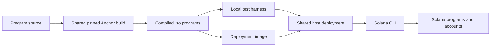

# Solana deployment

The image packages Anchor's compiled `.so` programs and a Node CLI. Solana's CLI owns
uploading and upgrading those programs. Our code owns selecting artifacts, checking the
existing deployment, and initializing the FHEVM host from the live gateway configuration.
It does not run the validator, listener, coprocessor or KMS.



## Build and run

`solana/scripts/build-programs.sh` is the build entry point for the local harness,
demo and Dockerfile. It checks the Anchor/Solana versions pinned in `Anchor.toml` and
builds the selected programs, including their Cargo dependencies. It does not cache by
source timestamps or maintain a separate artifact registry.

```sh
bash solana/scripts/build-programs.sh localnet zama_host confidential_token
# Default image profile is preview-env; localnet builds are used by packaged CLI tests.
docker build -f solana/deploy/Dockerfile -t solana-programs:<sha> .
docker run --rm --env-file /path/to/deployment.env solana-programs:<sha> host deploy
docker run --rm --env-file /path/to/deployment.env solana-programs:<sha> host upgrade
docker run --rm --env-file /path/to/deployment.env solana-programs:<sha> demos deploy
```

Profiles select **compiled program identities**, not RPC networks. The same artifact can
run on a local validator or another Solana cluster at those identities. A new identity
requires rebuilding; changing `SOLANA_RPC_URL` cannot change `declare_id!`. Tests check
that Rust declarations, Anchor configuration and deployer profiles agree. Existing IDL
and generated-client checks remain authoritative for the local client ABI.

The local e2e harness builds and selects the host, token and two specimen programs. The
`host` image command selects only the host. `demos` selects confidential-token, demo-vault
and confidential-batcher. Wallets, mints and example data remain separate test fixtures.

## Deployment and upgrade behavior

| Observed state | Result |
| --- | --- |
| Program absent, valid inputs and first-deploy key supplied | Deploy and initialize missing host accounts |
| Same bytecode and matching host configuration | Success, log `unchanged`, return existing addresses |
| Host initialized but KMS context missing | Complete the missing initialization |
| Different bytecode with `deploy` | Fail before uploading; require explicit `upgrade` |
| Different bytecode with `upgrade` | Check authority, upgrade at the same address, preserve accounts |
| Incompatible configuration or malformed initial inputs | Fail before changing bytecode |
| Another deployment holds the host lock | Fail promptly; retry after it finishes |

Bytecode comparison reads the deployed program through the Solana CLI and accounts for
zero-filled allocation padding. Deployment waits for the loader's next-slot activation.
All RPC commands use the supplied signer and confirmed commitment, including bootstrap
preflight; they do not depend on the developer's global Solana configuration.

Every caller for the same host/cluster uses a PostgreSQL advisory lock through
`SOLANA_DEPLOY_DATABASE_URL`. The lock covers validation, deployment and initialization.
Use the **same database** from CI, Kubernetes and local invocations; port-forwarding to
that database is fine. The lock uses the Solana genesis hash and host ID. It creates no
tables and releases on session close. The local harness uses its existing coprocessor DB.

`SOLANA_DEPLOYER_KEYPAIR` and `SOLANA_<PROGRAM>_KEYPAIR` accept standard Solana keypair
paths; their `_JSON` counterparts support Kubernetes Secret injection. Original program
keypairs are needed only for first deployment. The fee payer/upgrade authority remains a
runtime input. No private key is a build input or packaged into the image.

A compatible upgrade preserves program IDs, PDAs and account data. This CLI does not
invent state migrations or make incompatible account layouts safe. Those changes need an
explicit migration or a fresh experiment. Helm rollback does not roll back on-chain code.

## Persistent preview

Use `preview-env-deploy.yml` with `solana_action=deploy` for the initial experiment.
Set `preview_namespace` to that run's namespace on later runs, with `deploy` for a no-op
check or `upgrade` to permit changed code. Set `solana_demos=true` to include applications.
The normal EVM preview path is unchanged. Solana currently requires the dedicated Anvil
gateway and canonical EVM host; Polygon and shared blockchain-dev combinations are rejected.

Image/chart overrides now use the validated `overrides` JSON input, adopting the parser
from Fred's #3681. The workflow does not depend on his blue-green deployment topology.
Solana images built by the workflow use its source revision, like the other components.

Initial bootstrap creates the gateway, KMS, canonical keys and databases once. Anvil is
configured to save state to its existing PVC. Later Solana rollouts preserve bootstrap
resources, verify recorded EVM contract code and canonical keys, then:

1. Validate/deploy/upgrade the host and register its chain on the gateway.
2. Register the host and mirror canonical key material in each coprocessor database.
3. Upgrade coprocessors, enable the singleton Yellowstone listener, and restart zkproof
   workers to refresh their host-chain cache.
4. Upgrade KMS connectors with every coprocessor's private proof endpoint; retain EVM
   configuration. Add the Solana chain to the relayer.
5. Wait for listener checkpoints to advance, then optionally deploy example programs.

The listener persists computations, MMR leaves and its checkpoint in the coprocessor DB.
Its proof API is a ClusterIP Service with bearer authentication and no public ingress.
Checkpoint progress proves stream delivery; confidential-operation/decryption acceptance
is still required to prove compute, proof serving and the connector path together.

### What Fred needs to provision

Supply `solana_secrets_namespace`, where the existing secret synchronization flow exposes:

| Secret | Keys |
| --- | --- |
| `solana-rpc` | `rpc-url`, `grpc-url`, `grpc-x-token` |
| `solana-deployer` | `deployer.json`; first-deploy program keys `zama_host.json`, `confidential_token.json`, `demo_vault.json`, `confidential_batcher.json` |
| `solana-proof-api` | `api-key`, shared by listeners and connectors |
| `solana-deployment-lock` | `database-url`, pointing to one shared existing PostgreSQL database for these program identities |

The workflow copies these named secrets into the preview without printing their contents.
Fred also needs a funded devnet deployer, the approved RPC/Yellowstone subscription, and
cluster routing to the provider, lock DB and internal proof Services. The host Job does
not require application keys. Optional program-key references allow retiring first-deploy
keys while retaining the upgrade authority.

A retained preview records its Solana genesis hash, topology and a digest of the RPC, deployer, proof and lock
credentials. Switching their source or changing these inputs fails instead of retargeting
existing history. Program-key removal is excluded from that digest. Credential rotation
and topology changes need a separately reviewed maintenance procedure; they are not
silently handled as application upgrades in this experiment.

### Stop, resume and reset

Keep one active experiment per shared set of public-devnet program IDs. Do not submit
transactions while its listener is down. Recovery relies on provider replay of transactions
**and Clock/SlotHashes updates**; verify actual retention and replay against the provider.
A checkpoint always takes precedence over a configured initial start slot.

Use `preview-env-destroy.yml` for explicit teardown. It destroys the off-chain history;
public Solana accounts remain. A new experiment after lost history needs fresh identities
and fixtures, or a proven complete restore/replay. Recreating a namespace does not reset
Solana. Failed bootstrap without a completed marker also requires explicit inspection/reset.
Anvil snapshots support this experiment's restart loop; they are not a production chain
or a guarantee of crash-consistent recovery across the whole distributed stack.

## Feedback and acceptance

```sh
bun test --cwd test-suite/fhevm src
python3 ci/preview-env/solana-host/test_charts.py
bash solana/scripts/build-programs.sh localnet zama_host
bun test --cwd test-suite/fhevm e2e/deployment/solana-deployment.test.ts
# Full owned stack, including real gateway/KMS/coprocessor:
bun run demo up
bun run --cwd test-suite/fhevm test:e2e
bun run demo restart-listener
bun run demo reseed --direct --upgrade-programs
bun run demo down
```

The isolated deployment test starts and cleans up its own validator/PostgreSQL and uses a
fixed gateway committee fixture. CI also runs it through the packaged Node CLI and its
image's host artifact. It checks real initialization, no-op behavior, configuration
rejection, an actual different compatible executable, retained HostConfig and contention.
The different executable uses another optimization level, without adding a test instruction
to the program. Full e2e additionally checks old-value decryption and new computation after
host upgrade and listener restart. This local evidence does not prove public-provider
replay or cluster connectivity; repeat that acceptance in the provisioned preview.
