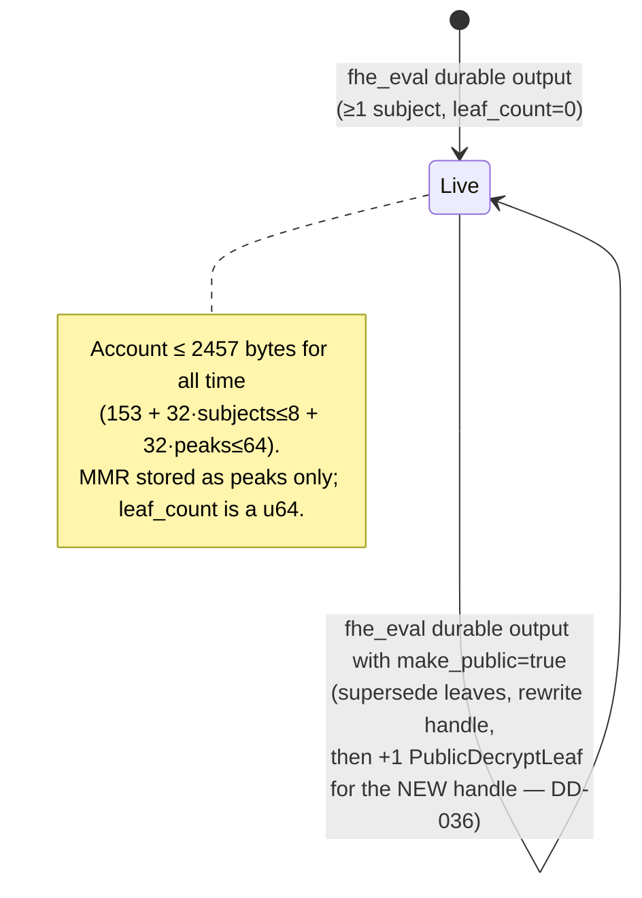
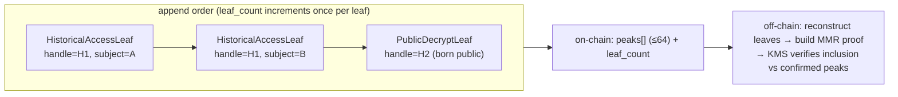
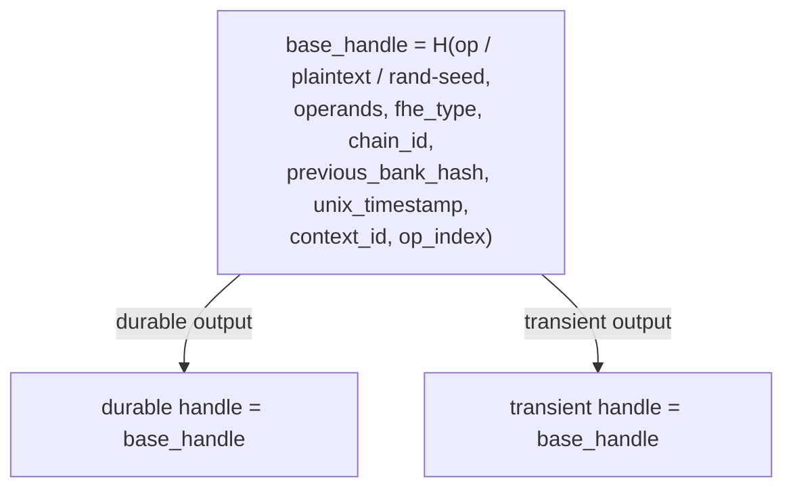
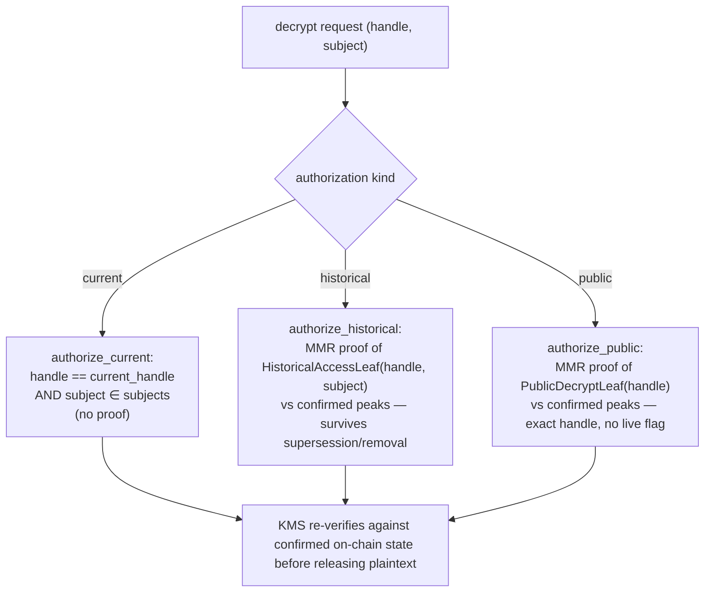
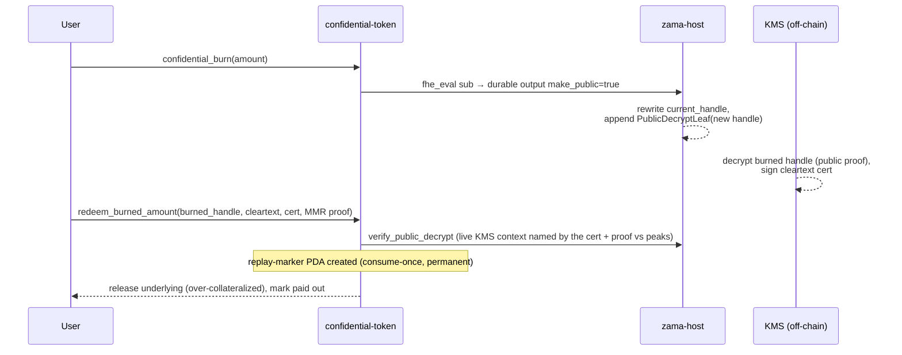
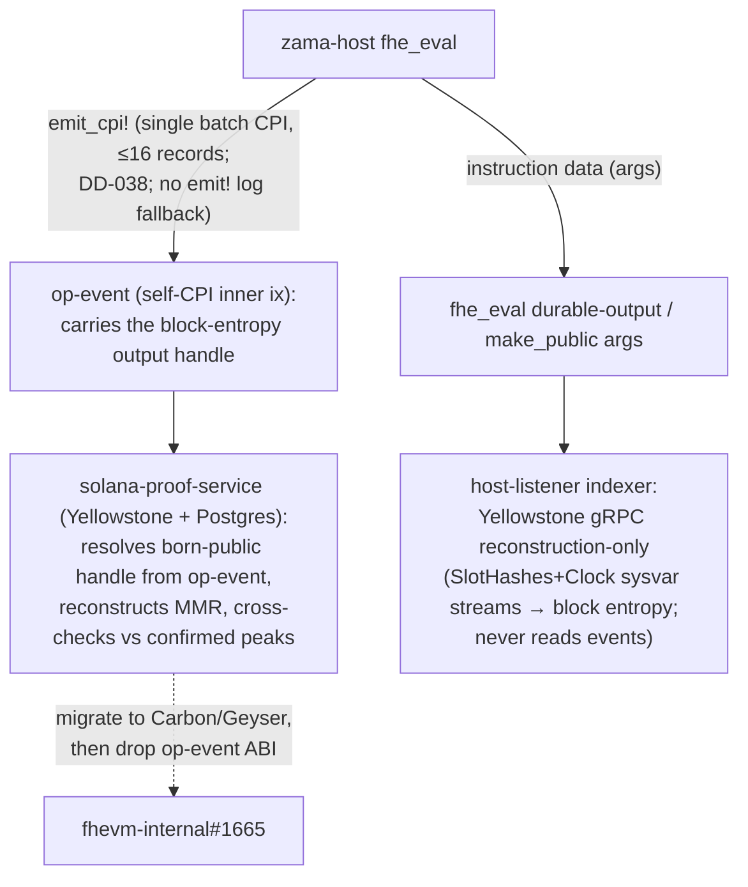

# MMR ACL MVP

This is the canonical reviewer map for the Solana `EncryptedValue` + MMR ACL MVP. The detailed
rationale lives in DD-031 through DD-037 in [`DESIGN_DECISIONS.md`](./DESIGN_DECISIONS.md);
this note records the operational model in one place.

## Identity And Authority

- `EncryptedValue` identity is `derive_value_key(acl_domain_key, app_account, encrypted_value_label)`.
  The derived key prevents collisions between app domains, accounts, and labels. It is not an
  authority check.
- `compute_signer` is separate from identity. In confidential-token it is a mint-scoped PDA and must
  be present in the value's allowed-subject set when token compute needs to use that value.
- Only `fhe_eval` durable outputs can create or supersede an `EncryptedValue` handle. The raw
  `create_encrypted_value` / `update_encrypted_value` instructions remain in the ABI but fail closed:
  they would otherwise accept caller-chosen handles without proving ciphertext provenance. Being an
  allowed subject is enough to compute/use, grant, request user decrypt, or make the exact current
  handle public, but it is not enough to supersede the encrypted value account. Durable-output supersession checks
  `previous_handle` and `previous_subjects` against current account state so stale off-chain state
  cannot rotate a handle.

## Handle Derivation

- A durable `fhe_eval` output handle **is the base handle** — identical to the transient handle over
  `(op / plaintext / rand-seed, operands, fhe_type, chain_id, previous_bank_hash, unix_timestamp,
  context_id, op_index)`. There is no per-output binding: a durable output and an instruction-local
  output over the same material derive the same handle. This matches EVM `FHEVMExecutor`, which binds
  no per-slot / per-caller / per-encrypted value account value into a computed handle. `value_key` is still the
  `EncryptedValue` PDA seed (`derive_value_key(acl_domain_key, app_account, encrypted_value_label)`) —
  it addresses *which* stored value the result becomes — but it is **not** mixed into the handle.
- There is **no per-output sequence and no encrypted value account binding** in the handle (DD-015). Per-block entropy
  plus the operands/op/type already distinguish distinct ciphertexts. An identical recomputation
  yields an identical handle (deterministic, EVM-parity).
- Off-chain indexers (host-listener, relayer) obtain durable output handles the same way as transient
  ones — the base-handle derivation over instruction args + block entropy, byte-identical to the
  program — with no encrypted value account leaf-count tracking and no handle hints.

## Allowed Subjects

- The ACL is one allowed-subject set. There are no role bits in the MVP account layout. Allowed means
  compute/use, grant another subject, request user decrypt, and make the exact current handle public.
- Durable-output creation requires at least one subject and at most
  `MAX_ENCRYPTED_VALUE_SUBJECTS = 8`. Subject-list overflow and MMR peak overflow fail explicitly
  instead of relying on implicit vector or arithmetic limits.
- Subject removal changes only current and future authorization. No new historical leaf is written for
  the removed subject after removal; access sealed before removal remains valid.
- Audience membership is immutable by default, but a durable-output supersede may explicitly rotate the
  subject set: `output_subjects` need not equal the stored set. The outgoing audience is sealed into
  historical leaves first (below), then the new set replaces current membership, and every subject the
  rotation adds passes the grant deny-list exactly as `allow_subjects` does. `previous_handle` and
  `previous_subjects` still pin the outgoing state exactly.

## History And Decrypt

- Historical authorization is handle-scoped and permanent. When a handle is superseded, the program
  seals one `HistoricalAccessLeaf` per then-allowed subject into the value's MMR. Historical reads roll
  forward by proving inclusion against confirmed on-chain peaks.
- Public decrypt is exact-handle. `make_handle_public` seals a `PublicDecryptLeaf` for the current
  handle only; a later handle update does not inherit public decryptability. An `fhe_eval` durable
  output may instead be *born* public by setting `make_public` on the output: after the new handle is
  written, the same `PublicDecryptLeaf` is sealed for that NEW handle in the same instruction —
  byte-identical to `make_handle_public`, appended LAST (after any supersede historical leaves). This
  is the one exception to "created encrypted value accounts cannot be born public-decryptable" (DD-036).
- Delegated user decrypt is isolated from the core ACL path. Delegation uses standalone
  `UserDecryptionDelegation` PDAs and does not add subjects or mutate `EncryptedValue`.

## Gates And Trust Boundary

- Pause gates ACL mutations plus `fhe_eval` output paths. The deny-list gates the acting
  caller/authority for grant and eval flows; it blocks new action and is not an erasure mechanism for
  already sealed history.
- Solana programs enforce authorization. The relayer, proof builder, host-listener ingestion, and
  coprocessor scheduling are untrusted for authorization. KMS ACL/proof verification reads confirmed
  on-chain facts, including live `EncryptedValue` state or MMR proof validity, before releasing
  plaintext. The host-listener reconstructs compute work and handle-only ciphertext-material requests
  from confirmed Yellowstone instructions. Subject grants and removals schedule no material work:
  material was requested when the handle was created, while KMS reads the live ACL at release time.
- Materiality is not Solana host state. DD-031 moved ciphertext material commitments to the gateway
  `CiphertextCommits`; Solana ACL state answers only who may use or decrypt a handle.
- The standalone `solana-proof-service` is an untrusted helper (DD-035). The end-to-end decrypt flow
  fetches historical and public MMR proofs from this service (semantic `GET /internal/solana/access-proof` and `/internal/solana/public-proof`); the
  KMS re-verifies each proof against confirmed on-chain peaks before releasing plaintext. One case is
  still built by the test client rather than the service: the amount burned during an unwrap, whose
  handle comes from block randomness and appears only in an event, so the events-off build has nothing
  for the service to read (tracked in fhevm-internal#1675).

## Flow Diagrams

### ValueAccount state + MMR growth

One stable `EncryptedValue` PDA per encrypted value account. `current_handle` is overwritten in place; the MMR only
ever grows (append-only), so historical and public-decrypt authorizations are permanent once sealed.

### MMR leaf types + append order

`fhe_eval` durable-output supersession appends one
`HistoricalAccessLeaf{account, leaf_index, handle, subject}` per then-allowed subject;
`make_handle_public` (or a born-public output) appends one
`PublicDecryptLeaf{account, leaf_index, handle}`. A single running `leaf_count` assigns `leaf_index`,
so replay order alone reproduces the leaf list — the reconstruction invariant (DD-033).

### Handle derivation (no per-output binding — DD-015)

### Decrypt authorization — three paths

### Burn → Redeem (Vector-2 closed, DD-036)

Pull-based, mirroring OZ `ConfidentialFungibleTokenERC20Wrapper` unwrap→finalizeUnwrap. The burned
delta is born public in the burn's `fhe_eval` CPI; redemption is a single `redeem_burned_amount` that
consumes the stateless host `verify_public_decrypt` verifier (the request-witness lifecycle was
dissolved in fhevm-internal#1763), authorizing by the pinned handle's public-decrypt proof against the
live KMS context the cert names (any non-destroyed context, fhevm-internal#1765), so it stays valid
after later burns supersede the encrypted value account.

### Event transport + off-chain reconstruction (DD-037)

Ingestion is Yellowstone-only: the host-listener always rebuilds events from instruction data and never
consumes emitted events. `emit_cpi!` is kept for one reason — the proof service / host-listener path reads it over
RPC to recover the handles of values made public at creation (those handles come from block randomness
and appear in no instruction argument). Both the on-chain events and the now-unused emit-decode listener
code are removed once Carbon indexing lands (fhevm-internal#1665, #1676).

## Resource Bounds And Liveness

No encrypted value account can be stranded by resource limits. The peak-based MMR decouples per-transaction cost from
history length, and every relevant bound is a hard, small constant:

- **Account size ceiling: 2457 bytes, forever.** `account_size = 153 + 32·subjects + 32·peaks`, with
  `subjects ≤ MAX_ENCRYPTED_VALUE_SUBJECTS = 8` and `peaks ≤ MAX_MMR_PEAKS = 64` (an MMR has exactly
  `popcount(leaf_count)` peaks, `leaf_count: u64`). Solana's per-transaction realloc cap is 10240
  bytes, so even growing a fresh encrypted value account to its maximum in one instruction stays ~4× under the wall.
- **Supersession cost is leaf-count-independent.** An 8-subject supersession appends 8 leaves =
  ≤ 8 leaf hashes + ≤ 64 peak-merge hashes = ≤ 80 SHA-256 ops, regardless of how old/large the encrypted value account
  is (binary-counter amortization on peaks). That is ~1–2% of the 1.4M CU budget; the margin does not
  shrink with age. (These are op-count estimates pending a mollusk CU-trace test.)
- **On-chain code never walks the full leaf list.** It touches only `peaks` (≤64) and the `leaf_count`
  scalar; `value_account::reconstruct` (O(leaf_count)) is off-chain / test-only. Proof verification is
  `log2(leaf_count) ≤ 64` hashes.
- **The only leaf-count-tied failure is u64 overflow** at ~1.8×10¹⁹ appends (unreachable), and it fails
  atomically (clean revert, no partial mutation, no stuck state).

Consolidating the per-subject historical leaves into one whole-subject-set leaf is a valid efficiency
optimization (smaller proofs, less rent) but is **not** a liveness or correctness fix and is deferred
to a follow-up.

## Decision Links

- DD-031: deleted host-owned `HandleMaterialCommitment`; materiality lives in `CiphertextCommits`.
- DD-032: introduced stable `EncryptedValue` encrypted value accounts, single allowed-subject ACL, and MMR leaves.
- DD-033: lifecycle instructions emit no events; indexers replay instruction data.
- DD-034: Solana compute is scheduled eagerly (`is_allowed` is a scheduling gate, not decrypt auth).
- DD-035: proof building is a standalone untrusted service; KMS re-verifies proofs against confirmed
  chain state.
- DD-036: burn-redemption consume authorizes by MMR public-decrypt proof (born-public delta), not the
  live handle — closes the Vector-2 fund-stranding window.
- DD-037: `fhe_eval` events are `emit_cpi!`-only (no `emit!` fallback); born-public outputs are
  restricted to CPI-transportable frames so their handles are always recoverable off-chain.
