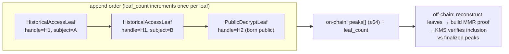
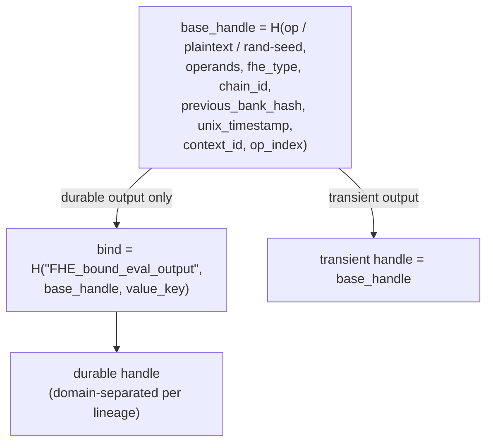
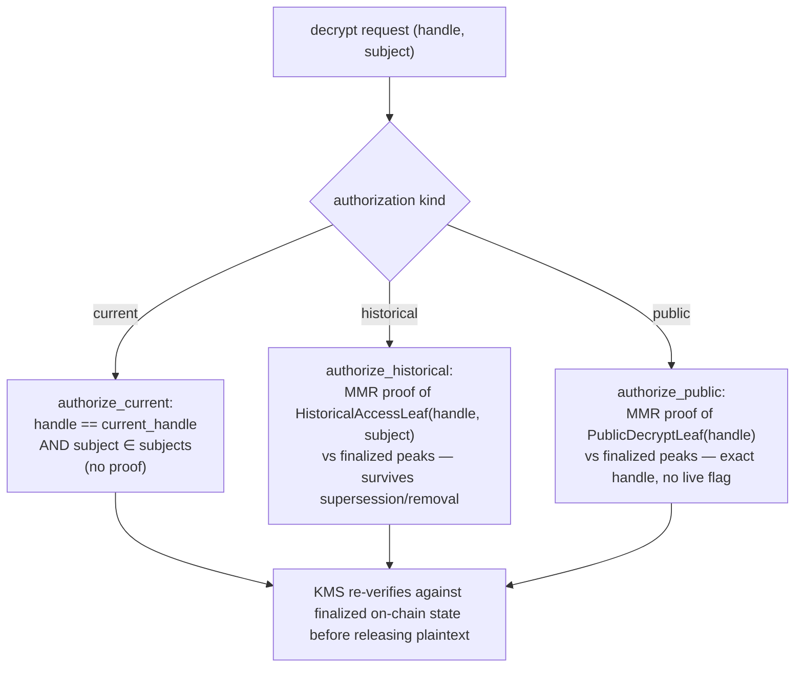
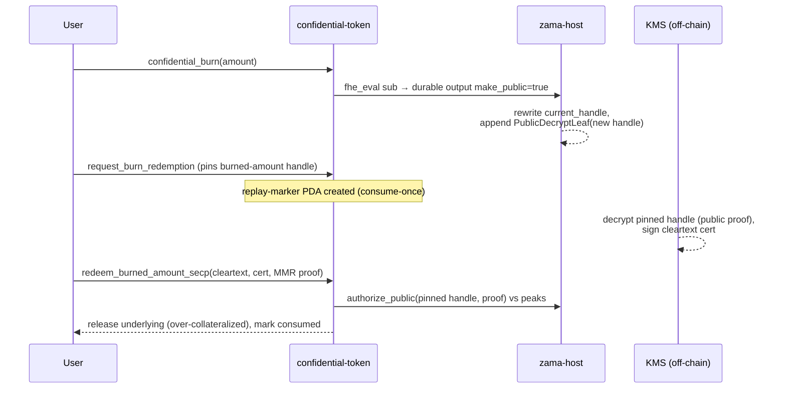
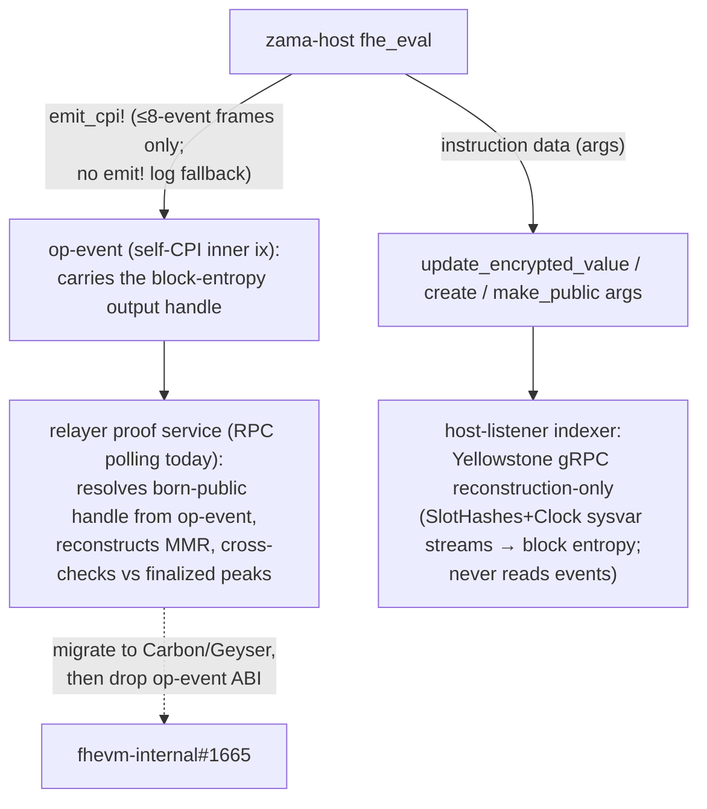

# MMR ACL MVP

This is the canonical reviewer map for the Solana `EncryptedValue` + MMR ACL MVP. The detailed
rationale lives in DD-031 through DD-035 in [`DESIGN_DECISIONS.md`](./DESIGN_DECISIONS.md);
this note records the operational model in one place.

## Identity And Authority

- `EncryptedValue` identity is `derive_value_key(acl_domain_key, app_account, encrypted_value_label)`.
  The derived key prevents collisions between app domains, accounts, and labels. It is not an
  authority check.
- `compute_signer` is separate from identity. In confidential-token it is a mint-scoped PDA and must
  be present in the value's allowed-subject set when token compute needs to use that value.
- Only the app-account authority can update `current_handle`. Being an allowed subject is enough to
  compute/use, grant, request user decrypt, or make the exact current handle public, but it is not
  enough to supersede the lineage. `update_encrypted_value` checks `previous_handle` and
  `previous_subjects` against current account state so stale off-chain state cannot rotate a handle.

## Handle Derivation

- A durable `fhe_eval` output handle is `bind(base_handle, value_key)`, where `base_handle` is the
  ordinary transient handle over `(op / plaintext / rand-seed, operands, fhe_type, chain_id,
  previous_bank_hash, unix_timestamp, context_id, op_index)` and `value_key` is the output lineage's
  identity. The `value_key` binding domain-separates the output from the unbound base and from other
  lineages.
- There is **no per-output sequence** in the handle. The earlier leaf-count nonce
  (`output_nonce_sequence`) was removed (DD-015): per-block entropy plus the operands/op/type already
  distinguish distinct ciphertexts, and this matches EVM `FHEVMExecutor`, which binds no per-output
  nonce. An identical recomputation therefore yields an identical handle (deterministic, EVM-parity).
- Off-chain indexers recompute durable output handles from the instruction args' `value_key` + block
  entropy alone — no lineage leaf-count tracking and no handle hints.

## Allowed Subjects

- The ACL is one allowed-subject set. There are no role bits in the MVP account layout. Allowed means
  compute/use, grant another subject, request user decrypt, and make the exact current handle public.
- Creation requires at least one subject and at most `MAX_ENCRYPTED_VALUE_SUBJECTS = 8`. Subject-list
  overflow and MMR peak overflow fail explicitly instead of relying on implicit vector or arithmetic
  limits.
- Subject removal changes only current and future authorization. No new historical leaf is written for
  the removed subject after removal; access sealed before removal remains valid.

## History And Decrypt

- Historical authorization is handle-scoped and permanent. When a handle is superseded, the program
  seals one `HistoricalAccessLeaf` per then-allowed subject into the value's MMR. Historical reads roll
  forward by proving inclusion against finalized on-chain peaks.
- Public decrypt is exact-handle. `make_handle_public` seals a `PublicDecryptLeaf` for the current
  handle only; a later handle update does not inherit public decryptability. An `fhe_eval` durable
  output may instead be *born* public by setting `make_public` on the output: after the new handle is
  written, the same `PublicDecryptLeaf` is sealed for that NEW handle in the same instruction —
  byte-identical to `make_handle_public`, appended LAST (after any supersede historical leaves). This
  is the one exception to "created lineages cannot be born public-decryptable" (DD-036).
- Delegated user decrypt is isolated from the core ACL path. Delegation uses standalone
  `UserDecryptionDelegation` PDAs and does not add subjects or mutate `EncryptedValue`.

## Gates And Trust Boundary

- Pause gates ACL mutations plus update/eval output paths. The deny-list gates the acting
  caller/authority for grant/update/eval flows; it blocks new action and is not an erasure mechanism
  for already sealed history.
- Solana programs enforce authorization. The relayer, proof builder, host-listener ingestion, and
  coprocessor scheduling are untrusted for authorization. KMS release must verify finalized on-chain
  facts, including live `EncryptedValue` state or MMR proof validity, before releasing plaintext.
- Materiality is not Solana host state. DD-031 moved ciphertext material commitments to the gateway
  `CiphertextCommits`; Solana ACL state answers only who may use or decrypt a handle.
- The relayer-colocated MMR proof service is an untrusted helper (DD-035). Current limitation: the
  relayer's Solana user-decrypt path does not yet call the proof builder in-process; proofs are
  attached out of band through the interim proof-service path.

## Flow Diagrams

### Lineage state + MMR growth

One stable `EncryptedValue` PDA per lineage. `current_handle` is overwritten in place; the MMR only
ever grows (append-only), so historical and public-decrypt authorizations are permanent once sealed.

### MMR leaf types + append order

`update_encrypted_value` appends one `HistoricalAccessLeaf{account, leaf_index, handle, subject}` per
then-allowed subject; `make_handle_public` (or a born-public output) appends one
`PublicDecryptLeaf{account, leaf_index, handle}`. A single running `leaf_count` assigns `leaf_index`,
so replay order alone reproduces the leaf list — the reconstruction invariant (DD-033).

### Handle derivation (no per-output sequence — DD-015)

### Decrypt authorization — three paths

### Burn → Redeem (Vector-2 closed, DD-036)

Pull-based two-phase, mirroring OZ `ConfidentialFungibleTokenERC20Wrapper` unwrap→finalizeUnwrap. The
burned delta is born public in the burn's `fhe_eval` CPI; redemption authorizes by the pinned handle's
public-decrypt proof, so it stays valid after later burns supersede the lineage.

### Event transport + off-chain reconstruction (DD-037)

## Resource Bounds And Liveness

No lineage can be stranded by resource limits. The peak-based MMR decouples per-transaction cost from
history length, and every relevant bound is a hard, small constant:

- **Account size ceiling: 2457 bytes, forever.** `account_size = 153 + 32·subjects + 32·peaks`, with
  `subjects ≤ MAX_ENCRYPTED_VALUE_SUBJECTS = 8` and `peaks ≤ MAX_MMR_PEAKS = 64` (an MMR has exactly
  `popcount(leaf_count)` peaks, `leaf_count: u64`). Solana's per-transaction realloc cap is 10240
  bytes, so even growing a fresh lineage to its maximum in one instruction stays ~4× under the wall.
- **Supersession cost is leaf-count-independent.** An 8-subject supersession appends 8 leaves =
  ≤ 8 leaf hashes + ≤ 64 peak-merge hashes = ≤ 80 SHA-256 ops, regardless of how old/large the lineage
  is (binary-counter amortization on peaks). That is ~1–2% of the 1.4M CU budget; the margin does not
  shrink with age. (These are op-count estimates pending a mollusk CU-trace test.)
- **On-chain code never walks the full leaf list.** It touches only `peaks` (≤64) and the `leaf_count`
  scalar; `lineage::reconstruct` (O(leaf_count)) is off-chain / test-only. Proof verification is
  `log2(leaf_count) ≤ 64` hashes.
- **The only leaf-count-tied failure is u64 overflow** at ~1.8×10¹⁹ appends (unreachable), and it fails
  atomically (clean revert, no partial mutation, no stuck state).

Consolidating the per-subject historical leaves into one whole-subject-set leaf is a valid efficiency
optimization (smaller proofs, less rent) but is **not** a liveness or correctness fix and is deferred
to a follow-up.

## Decision Links

- DD-031: deleted host-owned `HandleMaterialCommitment`; materiality lives in `CiphertextCommits`.
- DD-032: introduced stable `EncryptedValue` lineages, single allowed-subject ACL, and MMR leaves.
- DD-033: lifecycle instructions emit no events; indexers replay instruction data.
- DD-035: proof building is relayer-colocated and untrusted; KMS re-verifies proofs against finalized
  chain state.
- DD-036: burn-redemption consume authorizes by MMR public-decrypt proof (born-public delta), not the
  live handle — closes the Vector-2 fund-stranding window.
- DD-037: `fhe_eval` events are `emit_cpi!`-only (no `emit!` fallback); born-public outputs are
  restricted to CPI-transportable frames so their handles are always recoverable off-chain.
