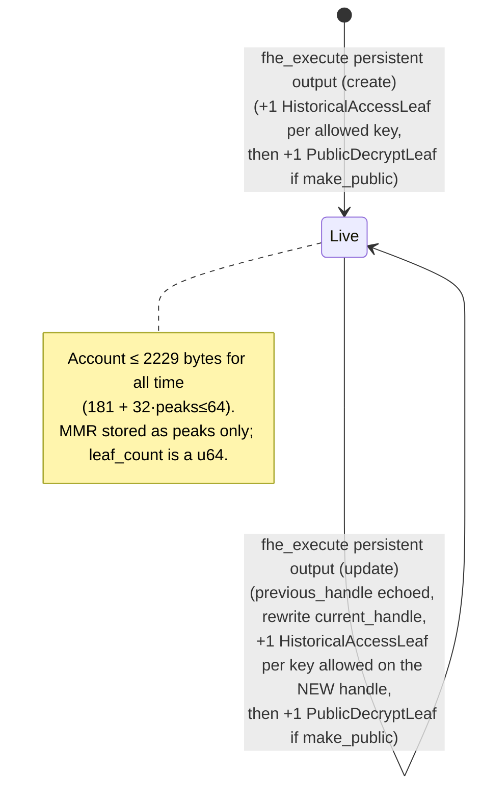
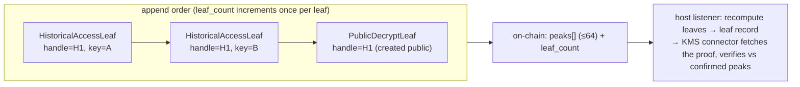
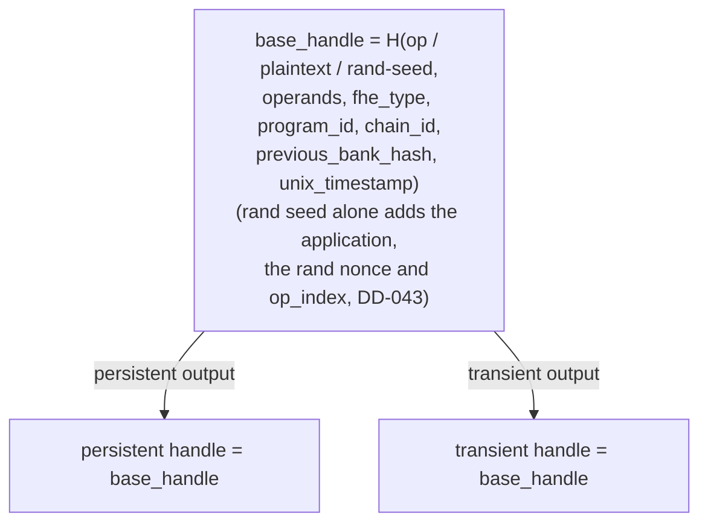
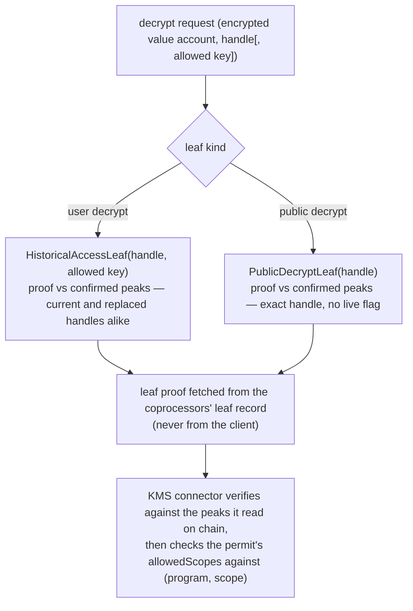
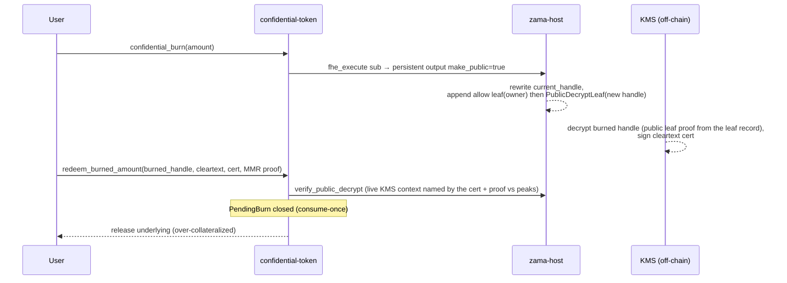
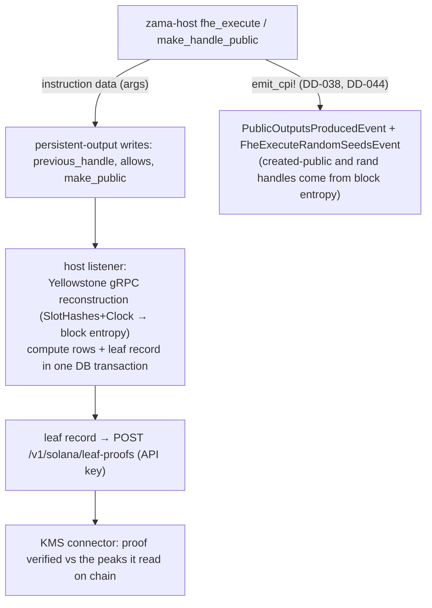

# MMR ACL MVP

This is the canonical reviewer map for the Solana `EncryptedValue` + MMR ACL, as RFC 035 left
it. The detailed rationale lives in DD-031 through DD-048 in
[`DESIGN_DECISIONS.md`](./DESIGN_DECISIONS.md); this note records the operational model in one
place.

## Identity And Authority

- An encrypted value account lives at
  `["encrypted-value", program, encrypted_value_account_authority, scope, label]` — four
  fixed-width seeds after the tag, no intermediate hash. The seeds are the identity and are
  stored in the account in the clear; nothing derives a key from them.
- `program` is verified, never declared: on every write the authority must be a PDA of `program`,
  proven by the seeds the execution declares (`assert_authority_is_program_pda`). That is what
  makes the application `(program, scope)` unforgeable — another program cannot sign for that
  authority, so it cannot claim that `program`. `scope` means whatever `program` says it means
  (the mint, for the token program).
- Only `fhe_execute` persistent outputs can create or update an `EncryptedValue` handle; there is
  no instruction that accepts a caller-chosen handle, because such a handle would carry no proof
  of ciphertext provenance. Reading a stored value into a computation is admitted by the value
  authority's signature and nothing else — there is no compute identity. Persistent-output update
  checks `previous_handle` against current account state so stale off-chain state cannot rotate a
  handle.
- Every output the execution touches must belong to one application (`FheExecuteMixedScopes`): the
  execution's `(program, scope)` is what the HCU meter charges, the deny list checks, and the rand
  seed binds.

## Handle Derivation

- A persistent `fhe_execute` output handle **is the base handle** — identical to the transient
  handle. Deterministic ops are content-addressed over `(op / plaintext, operands, fhe_type,
  program_id, chain_id, previous_bank_hash, unix_timestamp)`; rand seeds alone carry uniqueness
  (the application, the rand nonce, `op_index`, see DD-043). There is no per-output binding: a
  persistent output and an instruction-local output over the same material derive the same
  handle. This matches EVM `FHEVMExecutor`, which binds no per-slot / per-caller / per-account
  value into a computed handle. The account's seeds address *which* stored value the result
  becomes — they are **not** mixed into the handle.
- Off-chain indexers obtain persistent output handles the same way as transient ones — the
  base-handle derivation over instruction args + block entropy, byte-identical to the program —
  with no leaf-count tracking and no handle hints.

## Allows

- The account keeps no list of who may decrypt. A write declares the keys allowed on the handle it
  installs (`PersistentOutput::allow`, in list order, `InvalidAllowKey` on a duplicate or zero
  key); the host seals one `HistoricalAccessLeaf{account, leaf_index, handle, key}` per key, then
  — when the output is `make_public` — one `PublicDecryptLeaf{account, leaf_index, handle}`. That
  order is the reconstruction contract.
- An allow is a viewer right and nothing more: a key allowed on a handle may decrypt that handle.
  It cannot grant peers, make the handle public, or write the value; those are the authority's, by
  signature. There is no instruction to add or remove an allow after the write — the next write
  declares the next handle's allows, and the old handle's stay sealed.
- A handle with no allows and no public leaf is undecryptable by everyone, including its author.

## History And Decrypt

- Every decrypt is a leaf proof. A user decrypt proves `HistoricalAccessLeaf(handle, allowed key)`
  against the account's confirmed peaks; the current handle and a replaced one authorize the same
  way, so "current" is not a separate path. A public decrypt proves `PublicDecryptLeaf(handle)`
  for that exact handle; a later handle does not inherit publicness.
- `make_handle_public` seals a `PublicDecryptLeaf` for the current handle; an `fhe_execute`
  output may instead be created public with `make_public`, sealing the same leaf for the NEW
  handle in the same instruction, appended after its allows (DD-036).
- The leaf and its sibling path live in the coprocessors' **leaf record**: the host listener
  recomputes every leaf from the confirmed instruction stream, stores it next to the compute rows
  it was derived with in the same database transaction, and serves proofs over
  `POST /v1/solana/leaf-proofs` behind an API key. The KMS connector fetches from every configured
  coprocessor, merges the answers (a proof beats no proof, more history beats less), and verifies
  each proof against the peaks it read on chain itself. The record supplies paths; the chain
  decides. Clients supply no proof, and a request carrying one is rejected.
- Delegated user decrypt is isolated from the core ACL path. Delegation uses standalone
  `UserDecryptionDelegation` PDAs and does not touch `EncryptedValue`; the connector reads the
  record (the authority-specific row or the delegator's wildcard row) and authorizes the delegate
  against the delegator's allow leaf.

## Gates And Trust Boundary

- Pause gates `fhe_execute`, `make_handle_public`, and delegation writes; the connector reads the
  same switch and refuses while paused. The deny list names an application `(program, scope)`
  (`set_deny_scope`, `DenyScopeRecord` at `["deny-scope", program, scope]`) and gates the allows
  it would seal — every persistent write and `make_handle_public` — because both are allows; it
  blocks new action and is not an erasure mechanism for already sealed history.
- Solana programs enforce authorization. The relayer, the leaf record, host-listener ingestion,
  and coprocessor scheduling are untrusted for authorization. The KMS connector reads confirmed
  on-chain facts — the encrypted value account and, for a delegated entry, the delegation record
  — verifies the leaf proof against those peaks, and checks the permit's `allowedScopes` against
  the account's `(program, scope)` before releasing plaintext.
- Materiality is not Solana host state. DD-031 moved ciphertext material commitments to the
  gateway `CiphertextCommits`; Solana ACL state answers only who may decrypt a handle.

## Flow Diagrams

### Encrypted value account state + MMR growth

One stable `EncryptedValue` PDA per encrypted value. `current_handle` is overwritten in place; the
MMR only ever grows (append-only), so allows and public sealings are permanent once sealed.

```mermaid
stateDiagram-v2
    [*] --> Live : fhe_execute persistent output (create)<br/>(+1 HistoricalAccessLeaf per allowed key,<br/>then +1 PublicDecryptLeaf if make_public)
    Live --> Live : make_handle_public<br/>(+1 PublicDecryptLeaf for the current handle)
    Live --> Live : fhe_execute persistent output (update)<br/>(previous_handle echoed, rewrite current_handle,<br/>+1 HistoricalAccessLeaf per key allowed on the NEW handle,<br/>then +1 PublicDecryptLeaf if make_public)
    note right of Live
        Account ≤ 2229 bytes for all time
        (181 + 32·peaks≤64).
        MMR stored as peaks only; leaf_count is a u64.
    end note
```

### MMR leaf types + append order

A write appends one `HistoricalAccessLeaf{account, leaf_index, handle, key}` per key it allows on
the handle it installs, in list order, then one `PublicDecryptLeaf{account, leaf_index, handle}`
when the handle is made public. A single running `leaf_count` assigns `leaf_index`, so replay
order alone reproduces the leaf list — the reconstruction invariant (DD-033).

```mermaid
flowchart LR
    subgraph append["append order (leaf_count increments once per leaf)"]
        direction LR
        H0["HistoricalAccessLeaf<br/>handle=H1, key=A"] --> H1["HistoricalAccessLeaf<br/>handle=H1, key=B"] --> P0["PublicDecryptLeaf<br/>handle=H1 (created public)"]
    end
    append --> peaks["on-chain: peaks[] (≤64) + leaf_count"]
    peaks --> verify["host listener: recompute leaves → leaf record<br/>→ KMS connector fetches the proof, verifies vs confirmed peaks"]
```

### Handle derivation (no per-output binding — DD-015)

```mermaid
flowchart TD
    base["base_handle = H(op / plaintext / rand-seed,<br/>operands, fhe_type, program_id, chain_id,<br/>previous_bank_hash, unix_timestamp)<br/>(rand seed alone adds the application,<br/>the rand nonce and op_index, DD-043)"]
    base -->|"persistent output"| dh["persistent handle = base_handle"]
    base -->|"transient output"| th["transient handle = base_handle"]
```

### Decrypt authorization — two leaves, one path

```mermaid
flowchart TD
    req["decrypt request (encrypted value account, handle[, allowed key])"] --> kind{leaf kind}
    kind -->|"user decrypt"| ah["HistoricalAccessLeaf(handle, allowed key)<br/>proof vs confirmed peaks — current and replaced handles alike"]
    kind -->|"public decrypt"| ap["PublicDecryptLeaf(handle)<br/>proof vs confirmed peaks — exact handle, no live flag"]
    ah & ap --> rec["leaf proof fetched from the coprocessors' leaf record<br/>(never from the client)"]
    rec --> kms["KMS connector verifies against the peaks it read on chain,<br/>then checks the permit's allowedScopes against (program, scope)"]
```

### Burn → Redeem (Vector-2 closed, DD-036)

Pull-based, mirroring OZ `ConfidentialFungibleTokenERC20Wrapper` unwrap→finalizeUnwrap. The burned
delta is created public in the burn's `fhe_execute` CPI; redemption is a single
`redeem_burned_amount` that consumes the stateless host `verify_public_decrypt` verifier (the
request-witness lifecycle was dissolved in fhevm-internal#1763), authorizing by the pending
handle's public-decrypt proof against the live KMS context the cert names (any non-destroyed
context, fhevm-internal#1765). The handle must still be current; a second burn on the same token
account is rejected until redemption or cancellation closes `PendingBurn`. The on-chain proof is
rebuilt by the client from the account's known leaf history (`[allowed(owner), markedPublic]`) and
cross-checked against the live peaks before it is sent.

```mermaid
sequenceDiagram
    participant U as User
    participant CT as confidential-token
    participant ZH as zama-host
    participant KMS as KMS (off-chain)
    U->>CT: confidential_burn(amount)
    CT->>ZH: fhe_execute sub → persistent output make_public=true
    ZH-->>ZH: rewrite current_handle,<br/>append allow leaf(owner) then PublicDecryptLeaf(new handle)
    KMS-->>KMS: decrypt burned handle (public leaf proof from the leaf record),<br/>sign cleartext cert
    U->>CT: redeem_burned_amount(burned_handle, cleartext, cert, MMR proof)
    CT->>ZH: verify_public_decrypt (live KMS context named by the cert + proof vs peaks)
    Note over CT: PendingBurn closed (consume-once)
    CT-->>U: release underlying (over-collateralized)
```

### Off-chain reconstruction

```mermaid
flowchart TD
    prog["zama-host fhe_execute / make_handle_public"] -->|"instruction data (args)"| ix["persistent-output writes: previous_handle, allows, make_public"]
    prog -->|"emit_cpi! (DD-038, DD-044)"| ev["PublicOutputsProducedEvent + FheExecuteRandomSeedsEvent<br/>(created-public and rand handles come from block entropy)"]
    ix --> listener["host listener:<br/>Yellowstone gRPC reconstruction (SlotHashes+Clock → block entropy)<br/>compute rows + leaf record in one DB transaction"]
    listener --> record["leaf record → POST /v1/solana/leaf-proofs (API key)"]
    record --> connector["KMS connector: proof verified vs the peaks it read on chain"]
```

Ingestion is Yellowstone-only: the host listener rebuilds every leaf from instruction data. The
event CPIs carry the handles that come from block entropy (created-public outputs, rand seeds) so
no consumer needs a historical bank-hash lookup; they grant nothing.

## Resource Bounds And Liveness

No encrypted value account can be stranded by resource limits. The peak-based MMR decouples
per-transaction cost from history length, and every relevant bound is a hard, small constant:

- **Account size ceiling: 2229 bytes, forever.** `account_size = 181 + 32·peaks`
  (`8 + 32·5 + 8 + (4 + 32·peaks) + 1`), with `peaks ≤ MAX_MMR_PEAKS = 64` (an MMR has exactly
  `popcount(leaf_count)` peaks, `leaf_count: u64`). The account is `realloc`-grown one peak at a
  time and never shrunk; Solana's per-transaction realloc cap is 10240 bytes, so even growing a
  fresh account to its maximum in one instruction stays ~4.5× under the wall. Pinned by
  `resource_bounds_match_liveness_doc` in `zama-solana-acl`.
- **Write cost is leaf-count-independent.** A write with `n` allows appends `n` (+1 public) leaves
  = that many leaf hashes + ≤ 64 peak-merge hashes each, regardless of how old the account is
  (binary-counter amortization on peaks). The app-side wall is the builder's heap budget, swept by
  the frontier grid in `zama-fhe/src/heap_budget/`; the host-side wall is swept per shape by
  `fhe_execute_boundary/*` (INVARIANTS #54, #61).
- **On-chain code never walks the full leaf list.** It touches only `peaks` (≤64) and the
  `leaf_count` scalar; `encrypted_value_account::reconstruct` (O(leaf_count)) is off-chain /
  test-only. Proof verification is `log2(leaf_count) ≤ 64` hashes.
- **The only leaf-count-tied failure is u64 overflow** at ~1.8×10¹⁹ appends (unreachable), and it
  fails atomically (clean revert, no partial mutation, no stuck state).

## Decision Links

- DD-031: deleted host-owned `HandleMaterialCommitment`; materiality lives in `CiphertextCommits`.
- DD-032: introduced stable `EncryptedValue` accounts and MMR leaves; amended by RFC 035 (allows
  sealed on the write, no stored list).
- DD-033: lifecycle instructions emit no ACL events; indexers replay instruction data.
- DD-034: Solana compute is scheduled eagerly (scheduling is not decrypt authorization).
- DD-035: retired — the standalone proof service is gone; the leaf record lives in the host
  listener and the connector fetches proofs itself.
- DD-036: burn-redemption consume authorizes by an MMR public-decrypt proof; DD-045 later narrows
  settlement to one current-handle `PendingBurn` per token account.
- DD-037/DD-038/DD-044: every event goes through the event CPI; the produced-public event carries
  the handles that come from block entropy.
- DD-039: the HCU block cap meters the application `(program, scope)`.
- DD-043: rand seeds bind the application, the rand nonce and the step index.
- DD-047: program verified, scope declared — the application identity.
- DD-048: allows sealed on the write, the deny list retargeted to applications, one connector
  path with coprocessor-served proofs.
