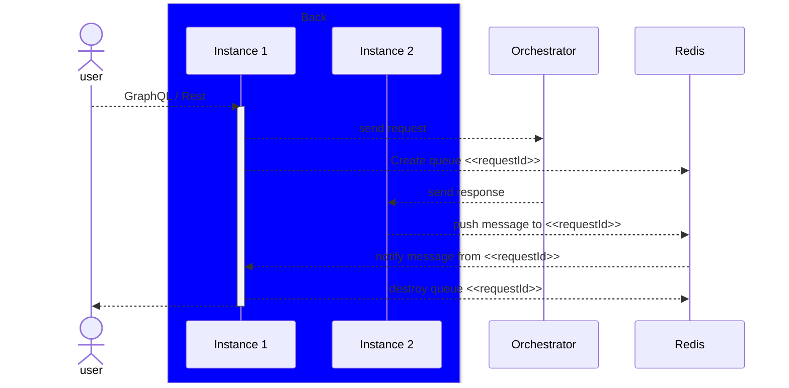

# Back Synchronization

The Back micro service exposes Graph QL and Rest APIs.

In some cases, it requires an HTTP Request to wait for a message to respond back to the user. When we have multiple instances of this micro service, it may happen that the instance that handles the message is not the one that should answer back to the HTTP request.

For that, we implemented a mechanism that enables instances synchronization via a Redis queue.

## How does it work

To achieve synchronization, after sending a message to the Orchestrator, the back instance create a Redis queue using an unique identifier: the request ID that each message has.

When a back instance receives a message from the orchestrator, it pushes to the just-created queue, retrieving the request ID from the message payload.

The initial instance gets a notification from the Redis queue, fetch the message and publish the response back to the user.

## Sequence diagram

## Implemented scenario

Currently, the scenarios that require the instance synchronizations are:

- address validation
- Input Proof
- User Decryption
