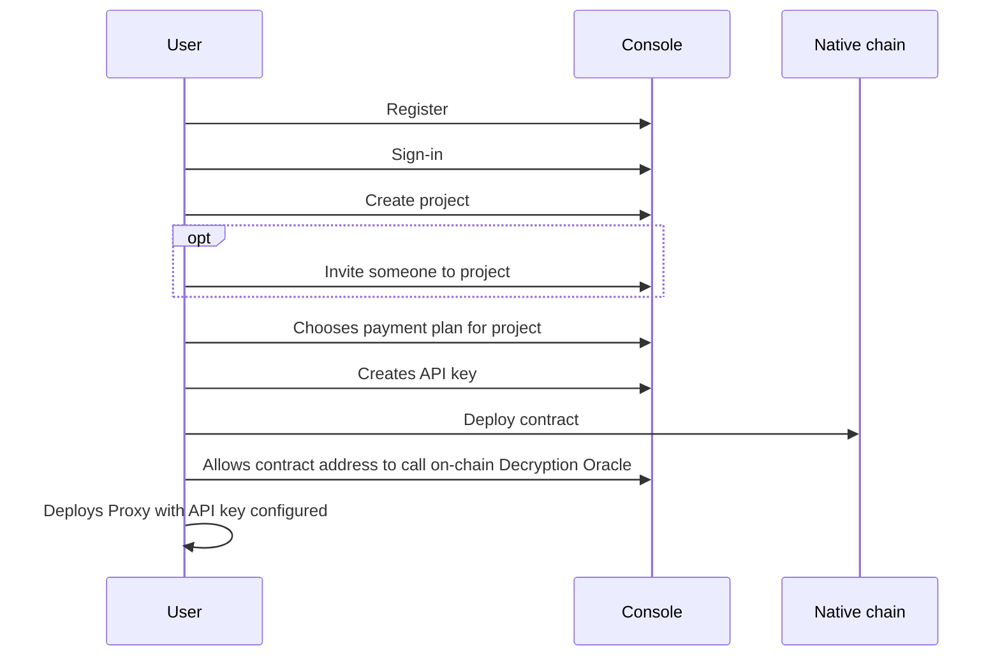

# Console

High-level view of user interactions with the Console

```mermaid
sequenceDiagram 
	User->>Console: Register 
	User->>Console: Sign-in 
	User->>Console: Create project
opt
	User->>Console: Invite someone to project
end
	User->>Console: Chooses payment plan for project
	User->>Console: Creates API key
	User->>Native chain: Deploy contract
	User->>Console: Allows contract address to call on-chain Decryption Oracle
	User->>User: Deploys Proxy with API key configured
```
