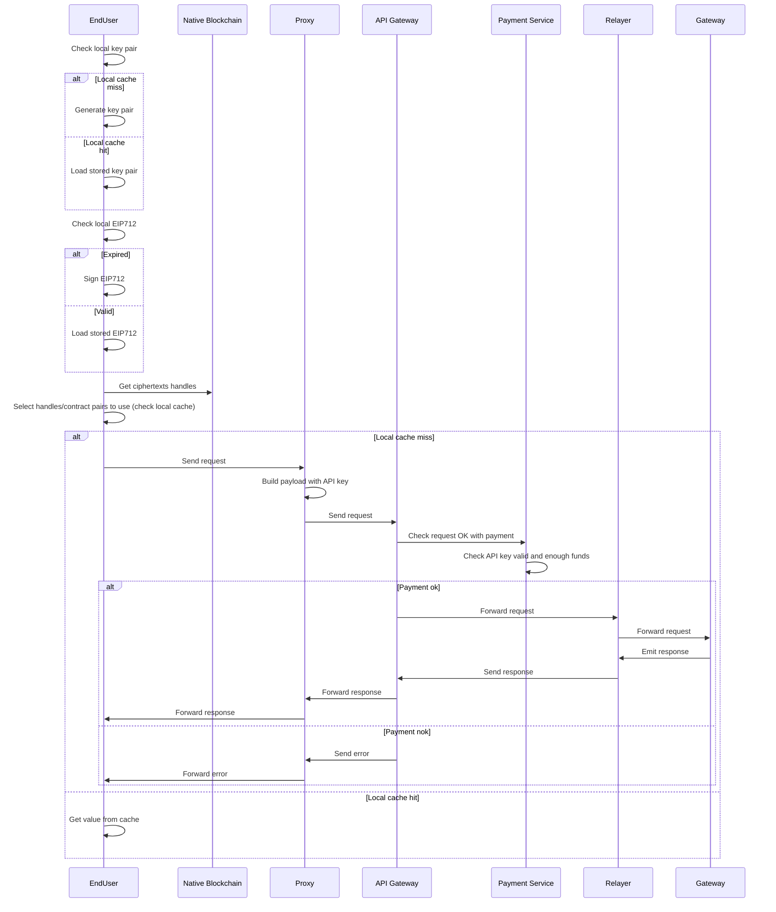

# User Decryption Flow

```mermaid
sequenceDiagram

EndUser ->> EndUser: Check local key pair
alt Local cache miss
	EndUser ->> EndUser: Generate key pair
else Local cache hit
	EndUser ->> EndUser: Load stored key pair
end

EndUser ->> EndUser: Check local EIP712
alt Expired
	EndUser ->> EndUser: Sign EIP712
else Valid
	EndUser ->> EndUser: Load stored EIP712
end

EndUser ->> Native Blockchain: Get ciphertexts handles
EndUser ->> EndUser: Select handles/contract pairs to use (check local cache)
alt Local cache miss
	EndUser ->> Proxy: Send request
	Proxy ->> Proxy: Build payload with API key
	Proxy ->> API Gateway: Send request
	API Gateway ->> Payment Service: Check request OK with payment
	Payment Service ->> Payment Service: Check API key valid and enough funds		
	alt Payment ok
		API Gateway ->> Relayer: Forward request
		Relayer ->> Gateway: Forward request
		Gateway ->> Relayer: Emit response
		Relayer ->> API Gateway: Send response
		API Gateway ->> Proxy: Forward response
		Proxy ->> EndUser: Forward response
	else Payment nok
		API Gateway ->> Proxy: Send error
		Proxy ->> EndUser: Forward error		
	end
else Local cache hit
	EndUser ->> EndUser: Get value from cache
end

```