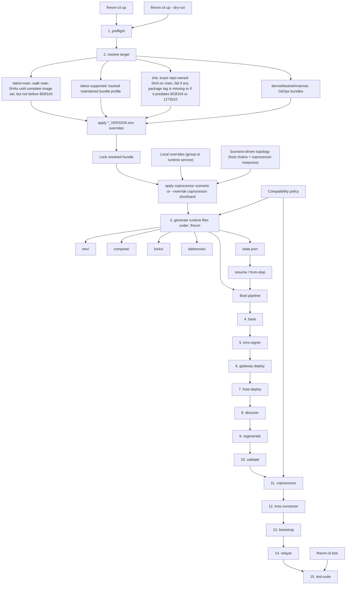

# fhevm-cli Architecture

This is the high-level shape of the Bun-based `fhevm-cli` after the topology-first multichain refactor.



## Topology Model

The CLI now models the stack as one topology with explicit scopes instead of a privileged primary host chain plus ad hoc extras.

- stack-scoped:
  - minio
  - shared db infra
  - kms-core
  - relayer
  - test-suite
  - gateway runtime
- chain-scoped:
  - host node
  - host contract deploy/add-pausers surfaces
  - host-chain address and discovery artifacts
- instance-scoped:
  - db-migration
  - gw-listener
  - tfhe-worker
  - zkproof-worker
  - sns-worker
  - transaction-sender
- instance-and-chain-scoped:
  - host-listener
  - host-listener-poller

`hostChains[0]` is the default chain for projections that still need one default host surface, but it is not a magic `"host"` runtime branch anymore.
Explicit scenarios may use any valid first host-chain key.

## Flow Modules

The lifecycle implementation is split by responsibility under `src/flow/`:

- `up-flow.ts`: high-level coordinator and public lifecycle entrypoints
- `topology.ts`: host-chain/default-chain helpers
- `discovery.ts`: endpoint and contract discovery validation
- `artifacts.ts`: generated runtime artifact contract and regeneration checks
- `readiness.ts`: container waits, bootstrap waits, and post-start crash gates
- `repair.ts`: resume repair and upgrade target planning
- `runtime-compose.ts`: compose up/down/build primitives
- `contracts.ts`: pause/unpause and contract-task execution

This split exists to keep boot, resume, upgrade, and contract-task logic on the same topology/runtime contract instead of hand-maintained parallel paths.

## Version Override (CI Integration)

After resolving a target bundle, `applyVersionEnvOverrides` overlays any matching `*_VERSION`
environment variables onto the bundle. This is the mechanism CI uses:

```
resolve target (e.g. latest-supported or latest-main)
  → tracked baseline profile or current mainline bundle
  → applyVersionEnvOverrides(bundle, process.env)
  → env vars like COPROCESSOR_HOST_LISTENER_VERSION=<sha> replace baseline versions
  → lock file records overrides in its "sources" field
```

The PR e2e workflow boots `latest-main` with the checked-in `two-of-two` scenario and forces `--build`, then runs `test standard` against that stack.

The merge queue workflow (`test-suite-orchestrate-e2e-tests.yml`) builds repo-owned Docker images
for touched components, injects the PR head short SHA only for successful build outputs, then calls
`./fhevm-cli up`.
For non-release PRs it first resolves a frozen base lock, so skipped components stay on the base bundle while rebuilt repo-owned services are overlaid from PR head tags.
For `release/*` PRs it follows the older base/head per-service selection path and explicitly carries over the base branch `CORE_VERSION`.
CI keeps the launch shape fixed at the `two-of-two-multi-chain` scenario. If a required build output failed, merge queue fails before dispatching e2e.

## Notes

- Version selection is explicit. The CLI does not silently use a vague "latest".
- `latest-main` is modern-only by construction. If no complete bundle exists after the floor SHA, resolution fails.
- `sha` currently has two floors: the simple-ACL cutover (`803f104`) and the modern gw-listener drift-address cutover (`1272b10`). Older SHAs fail fast instead of booting into unsupported runtime behavior.
- The resolved bundle is printed and locked before the real boot continues.
- Runtime precedence is fixed: bundle -> `*_VERSION` env overrides -> coprocessor scenario/shorthand -> generated runtime files.
- `--build` expands to the full local workspace on normal stacks. With topology-only scenarios, it also applies local coprocessor images to inherited scenario instances. If a scenario explicitly pins coprocessor source, overlapping explicit coprocessor overrides fail fast.
- `.fhevm` is the only mutable runtime area owned by the CLI.
- Tracked inputs are split by role:
  - compose templates: `docker-compose/*.yml`
  - env templates: `templates/env/.env.*`
  - generated config templates: `templates/config/relayer.yaml`, `templates/config/kms-core-*.toml`
  - static config: `static/config/prometheus/prometheus.yml`
  - checked-in scenario inputs under `scenarios/` (`two-of-two.yaml`, `two-of-two-multi-chain.yaml`, `multi-chain.yaml`)
- `src/stack-spec/stack-spec.ts` resolves the final stack spec consumed by generation.
- `src/generate/env.ts`, `src/generate/config.ts`, and `src/generate/compose.ts` are the only generation layers.
- Compatibility is enforced in two layers: `src/compat/compat.ts` defines shims and incompatibilities, and `bun run compat-smoke` probes the generated legacy command/env contract. It is not a full rendered-runtime replay.
- Discovery is not terminal output only. It feeds env regeneration before dependent services start.
- Resume is step-based via `state.json`; `down` stops containers, prunes `.fhevm/runtime`, keeps `.fhevm/state`, and `clean` removes both.
- Tracked compose files are the default runtime truth. `.fhevm/runtime/compose` only contains generated overrides for coprocessor topology and active local-override components.
- CI follows the same contract: direct PR e2e boots `latest-main --build` with the checked-in `two-of-two` scenario and runs `test standard`, while orchestrated e2e boots `two-of-two-multi-chain` with `build=false`, resolves either a non-release base lock or a release base/head matrix, overlays selected `*_VERSION` image refs, runs `test standard`, then runs `test multi-chain-isolation` as a dedicated final check.
- `upgrade` is intentionally narrow: it only rebuilds and restarts active runtime override groups or local coprocessor scenario instances.
- `up --dry-run` exercises the same target-aware resolve and preflight path without mutating runtime state.
