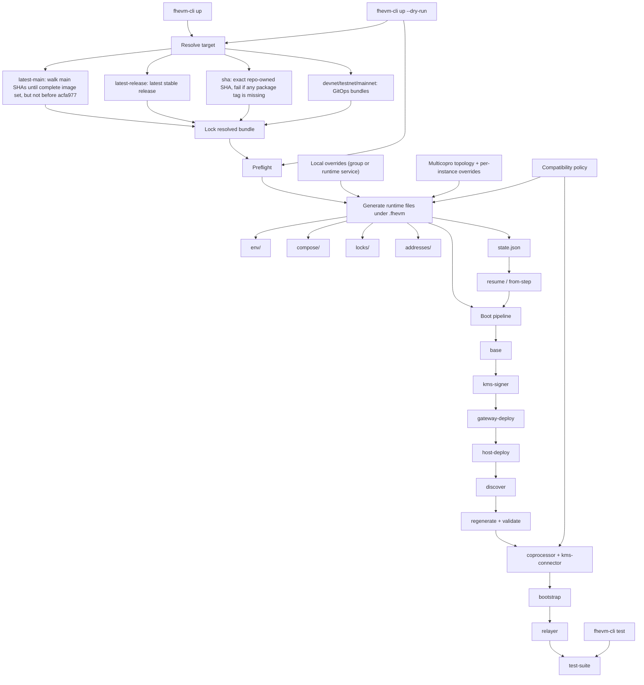

# fhevm-cli Architecture

This is the high-level shape of the Bun-based `fhevm-cli`.



## Version Override (CI Integration)

After resolving a target bundle, `applyVersionEnvOverrides` overlays any matching `*_VERSION`
environment variables onto the bundle. This is the mechanism CI uses:

```
resolve target (e.g. latest-release)
  → baseline bundle with release tag for all repo-owned packages
  → applyVersionEnvOverrides(bundle, process.env)
  → env vars like COPROCESSOR_HOST_LISTENER_VERSION=<sha> replace baseline versions
  → lock file records overrides in its "sources" field
```

The merge queue workflow (`test-suite-orchestrate-e2e-tests.yml`) builds Docker images tagged
with the PR's HEAD SHA, exports them as env vars, then calls `./fhevm-cli up --target latest-release`.
The target provides companion defaults (CORE_VERSION, RELAYER_VERSION); the env vars provide
the SHA-tagged images for every component built from the PR.

## Notes

- Version selection is explicit. The CLI does not silently use a vague "latest".
- `latest-main` is modern-only by construction. If no complete bundle exists after the floor SHA, resolution fails.
- The resolved bundle is printed and locked before the real boot continues.
- `.fhevm` is the only mutable runtime area owned by the CLI.
- Discovery is not terminal output only. It feeds env regeneration before dependent services start.
- Resume is step-based via `state.json`, not "rerun the bash ritual and hope".
- `upgrade` is intentionally narrow: it only rebuilds and restarts active runtime override groups.
- `up --dry-run` exercises the same target-aware resolve and preflight path without mutating runtime state.
