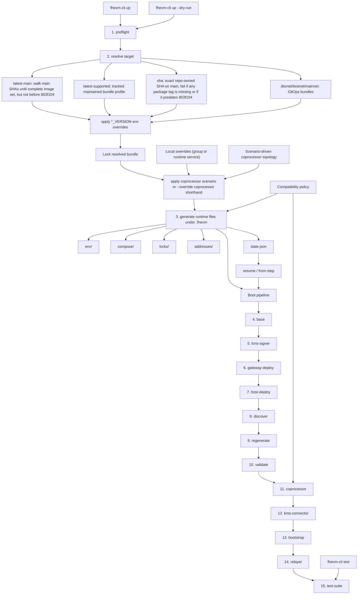

# fhevm-cli Architecture

This is the high-level shape of the Bun-based `fhevm-cli`.



## Version Override (CI Integration)

After resolving a target bundle, `applyVersionEnvOverrides` overlays any matching `*_VERSION`
environment variables onto the bundle. This is the mechanism CI uses:

```
resolve target (e.g. latest-supported or latest-main)
  → tracked baseline profile or current mainline bundle
  → applyVersionEnvOverrides(bundle, process.env)
  → env vars like COPROCESSOR_HOST_LISTENER_VERSION=<sha> replace baseline versions
  → lock file records overrides in its "sources" field
```

The merge queue workflow (`test-suite-orchestrate-e2e-tests.yml`) builds repo-owned Docker images
for touched components, injects the PR head short SHA only for successful build outputs, then calls
`./fhevm-cli up`.
The target provides the current mainline bundle; the env vars provide
the merge-candidate SHA-tagged images for components that were actually rebuilt from the PR, and CI keeps the launch shape fixed at `latest-main` plus the `two-of-two` scenario, optionally adding `--build`.
If a repo-owned image build was skipped, merge queue leaves that component on the `latest-main` baseline. If a required build output failed, merge queue fails before dispatching e2e.
Non-workspace companions still come from `COMPAT_MATRIX.externalDefaults`.

## Notes

- Version selection is explicit. The CLI does not silently use a vague "latest".
- `latest-main` is modern-only by construction. If no complete bundle exists after the floor SHA, resolution fails.
- The resolved bundle is printed and locked before the real boot continues.
- Runtime precedence is fixed: bundle -> `*_VERSION` env overrides -> coprocessor scenario/shorthand -> generated runtime files.
- `--build` expands to the full local workspace on normal stacks and to the non-coprocessor workspace groups when a scenario already owns coprocessor locality.
- `.fhevm` is the only mutable runtime area owned by the CLI.
- Tracked inputs are split by role:
  - compose templates: `docker-compose/*.yml`
  - env templates: `templates/env/.env.*`
  - relayer template config: `templates/config/relayer.yaml`
  - static config: `static/config/kms-core/config.toml`, `static/config/prometheus/prometheus.yml`
  - scenario inputs: `scenarios/*.yaml`
- `src/runtime-plan.ts` resolves the final coprocessor/runtime shape consumed by regeneration.
- `src/render-env.ts`, `src/render-config.ts`, and `src/render-compose.ts` are the only rendering layers.
- Discovery is not terminal output only. It feeds env regeneration before dependent services start.
- Resume is step-based via `state.json`, not "rerun the bash ritual and hope".
- Tracked compose files are the default runtime truth. `.fhevm/compose` only contains generated overrides for coprocessor topology and active local-override components.
- CI follows the same contract: e2e flows boot `latest-main`, overlay PR-built image refs through `*_VERSION` env vars, use checked-in scenarios for multicopro runs, and use `--build` for full local-workspace coverage.
- `upgrade` is intentionally narrow: it only rebuilds and restarts active runtime override groups or local coprocessor scenario instances.
- `up --dry-run` exercises the same target-aware resolve and preflight path without mutating runtime state.
