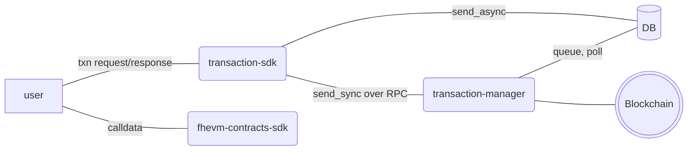

# Transaction Manager

The Transaction Manager is a set of services and libraries that reliably send blockchain transactions. It is used by all FHEVM components that send transactions. It consists of three components:

 - `transaction-manager` - a service (binary) that runs in the background, accepts transaction requests and sends them to the blockchain
 - `transaction-sdk` - a Rust library to interact with the transaction-manager
 - `fhevm-contracts-sdk` - a convenience Rust library to create calldata for calls to FHEVM contracts

## Architecture

Transaction Manager supports two types of transaction sending - `sync` and `async`.

### Sync Transaction Sending

Some use cases require that a transaction is sent and the outcome is known immediately. For such cases, sync sending works by the transaction-sdk sending a RPC call to the transaction-manager and waiting for the response. On the transaction-manager side, gas estimation will be done and the transaction will be broadcast to the blockchain. Once the receipt is received, the response will be returned over RPC to the user.

Sync sending doesn't require persistence and, therefore, no interaction with the DB is needed.

In terms of retries, the user might optionally specify a retry logic when sending the transaction. Users might also select how many confirmations to wait for.

### Async Transaction Sending

Other use cases require that a transaction is eventually sent or, optionally, is eventually sent with guarantees. For such cases, async sending works by the transaction-sdk inserting the transaction to the DB and notifying the transaction-manager. On the transaction-manager side, the transaction will be fetched and sent to the blockchain.

Since there might be failures in sending, we require persistence of the transaction in the DB, such that retries can be attempted. That also includes cases of the transaction-manager crashing or being stopped.

Sending an async transaction returns an unique identifier to the user that can later be used to query the state of the transaction, cancel it if not already sent, etc.

### transaction-sdk

The transaction-sdk is a high-level library that abstracts most of the details of how sending works under the hood. For example, wallet configuration would happen on the transaction-manager side and users won't be concerned with it. Also, nonce management is transparent to transaction-sdk users.

At a minumum, the user supplies the following pieces of data when sending:

- destination contract address (and potentially chain)
- calldata
- optional retry settings
- optional error handling settings

#### Error Handling

When sending async transactions, some errors returned from the destination smart contract can be treated as non-errors. For example, if an action has already been done, there's no need to retry the transaction anymore. For such cases, the transaction-sdk allows users to specify such errors when sending the transaction.

## Data Format

The transaction-sdk and transaction-manager **are not aware of the contents** of the transactions being sent. Instead, they only care about the destination chain + contract and the calldata.

The fhevm-contracts-sdk can be used to create FHEVM-specific contract calldata.

Such distinction makes the transaction-manager and transaction-sdk independent of the use case. Furthermore, they don't have to be restarted or updated in case of contract changes.

## Reorg/Fork Handling for Async Transactions

Users require that some transaction types be included in the blockchain with certainty. For these, the transaction-manager needs to be aware of reorgs/forks on the blockchain. If one is detected, transactions that could possibly be affected need to be replayed.

## Secret Key and Nonce Management

The transaction-manager will maintain a set of keys used for sending transactions. The keys could be kept in plaintext files or AWS KMS. Other methods can be added in the future.

In terms of nonce management, the transaction-manager will send transactions in parallel from different keys (wallets) and will also cache nonces locally. If a nonce mismatch is found, it will fetch a fresh nonce from the blockchain and go from there.

## Manual Resend for Async Transactions by Operations

Since data is persisted to the DB when sending async transactions, operations teams can easily replay any set of transactions that have already been sent. That can be triggered through the DB.
